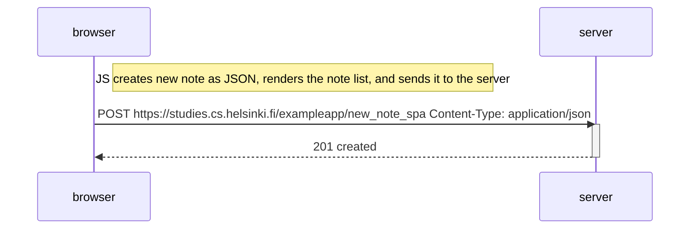

```mermaid
sequenceDiagram
participant browser
participant server

  Note right of browser: JS creates new note as JSON, renders the note list, and sends it to the server

  browser->>server: POST https://studies.cs.helsinki.fi/exampleapp/new_note_spa Content-Type: application/json
  activate server
  server-->>browser: 201 created
  deactivate server

```
